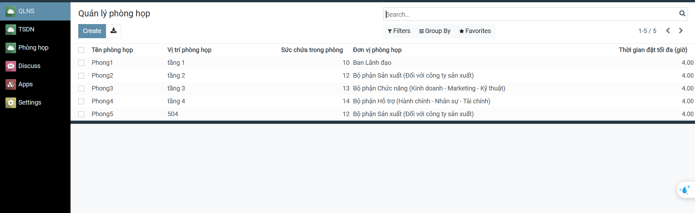
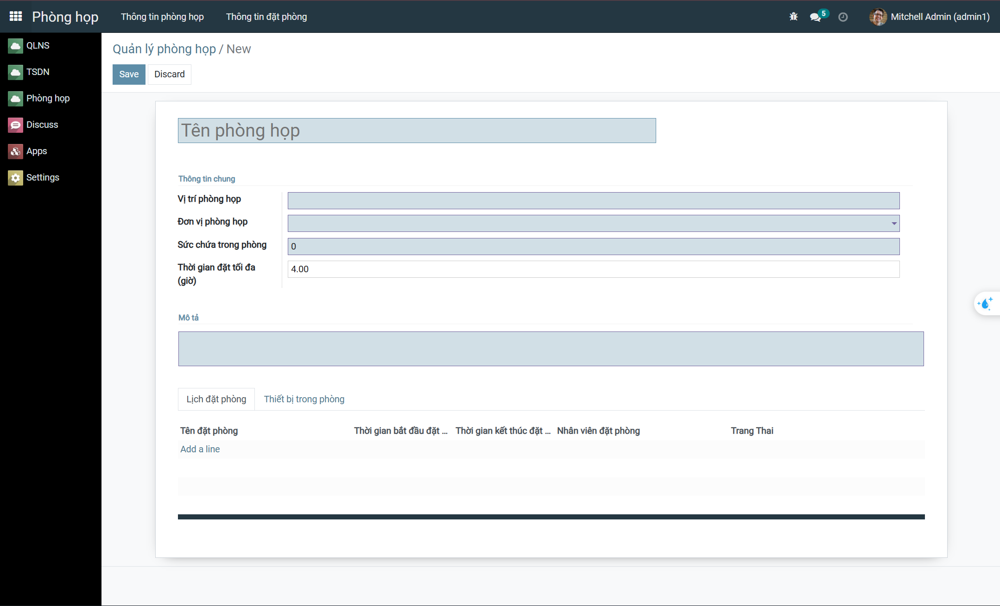
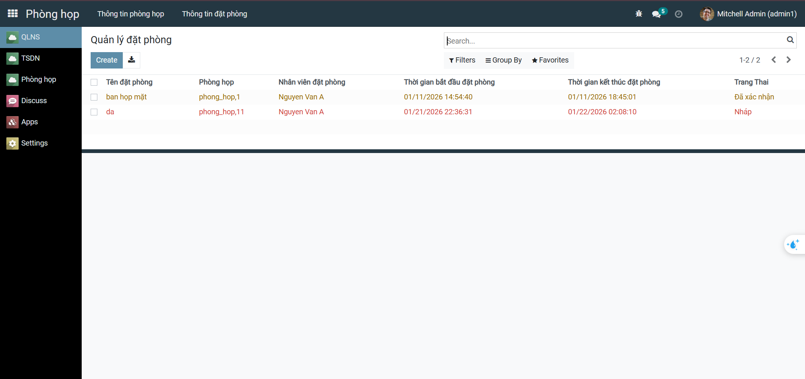
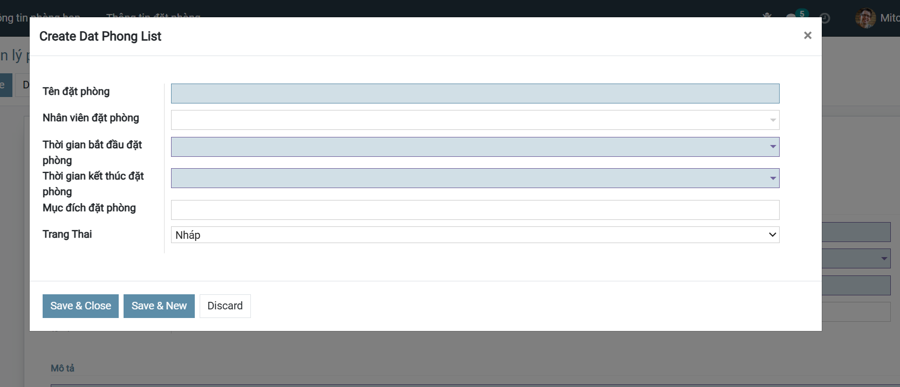
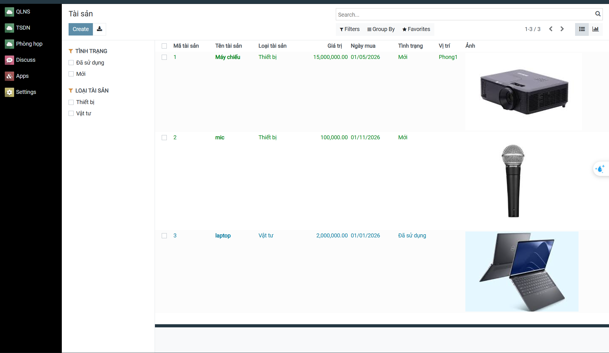
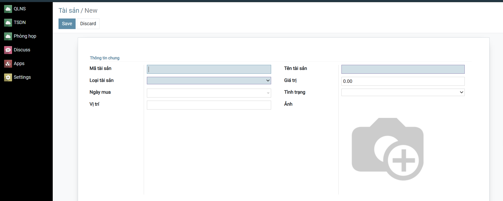
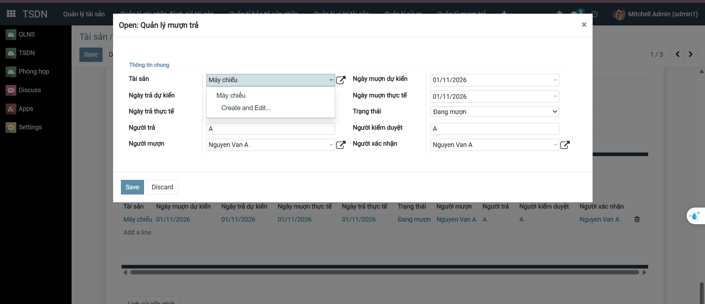
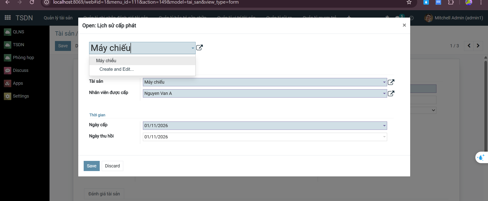

<h2 align="center">
    <a href="https://dainam.edu.vn/vi/khoa-cong-nghe-thong-tin">
    🎓 Faculty of Information Technology (DaiNam University)
    </a>
</h2>
<h2 align="center">
    Youth Union Member Management
</h2>
<div align="center">
    <p align="center">
        
        
        
    </p>

[](https://www.facebook.com/DNUAIoTLab)
[](https://dainam.edu.vn/vi/khoa-cong-nghe-thong-tin)
[](https://dainam.edu.vn)

</div>

## 📖 1. Giới thiệu
Hệ thống Quản lý tài sản và Phòng họp được xây dựng nhằm số hóa công tác quản lý phòng họp và tài sản dùng chung trong đơn vị, tích hợp với module Quản lý nhân sự. Hệ thống cho phép theo dõi thông tin phòng họp, tài sản, nhân viên sử dụng, lịch sử đặt phòng và kiểm soát trùng lịch, giúp tối ưu việc sử dụng tài nguyên và nâng cao hiệu quả quản lý.

## 🔧 2. Các công nghệ được sử dụng
<div align="center">

### Hệ điều hành

[](https://www.microsoft.com/en-us/windows/)
[](https://ubuntu.com/)

### Công nghệ chính
[](https://www.w3.org/XML/)
[](https://www.python.org/)
[](https://www.odoo.com/)


### Database Management Tools
[](https://www.postgresql.org/)
</div>

## 🚀 3. Hình ảnh các chức năng
<div align="center">
  <p><strong>1. Quản lý phòng họp</strong></p>
  <table>
    <tr>
      <td align="center">
        <br>
        <sub>Quản lý phòng</sub>
      </td>
      <td align="center">
        <br>
        <sub>Tạo phòng họp</sub>
      </td>
      <td align="center">
        <br>
        <sub>Quản lý đặt phòng</sub>
      </td>
      <td align="center">
        <br>
        <sub>Tạo phòng đặt</sub>
      </td>
    </tr>
  </table>
</div>

<div align="center">
  <p><strong>1. Quản lý tài sản</strong></p>
  <table>
    <tr>
      <td align="center">
        <br>
        <sub>Quản lý tài sản</sub>
      </td>
      <td align="center">
        <br>
        <sub>Tạo tài sản</sub>
      </td>
      <td align="center">
        <br>
        <sub>Quản lý mượn trả</sub>
      </td>
      <td align="center">
        <br>
        <sub>Lịch sử cấp phát</sub>
      </td>
    </tr>
  </table>
</div>

### 4. Cài đặt công cụ, môi trường và các thư viện cần thiết

## 4.1.1. Clone project.
https://github.com/Khanhlaptrinh/TTDN-16-06-N6.git

## 4.1.2. cài đặt các thư viện cần thiết

Người sử dụng thực thi các lệnh sau đề cài đặt các thư viện cần thiết

```
sudo apt-get install libxml2-dev libxslt-dev libldap2-dev libsasl2-dev libssl-dev python3.10-distutils python3.10-dev build-essential libssl-dev libffi-dev zlib1g-dev python3.10-venv libpq-dev
```
## 4.1.3. khởi tạo môi trường ảo.

`python3.10 -m venv ./venv`
Thay đổi trình thông dịch sang môi trường ảo và chạy requirements.txt để cài đặt tiếp các thư viện được yêu cầu

```
source venv/bin/activate
pip3 install -r requirements.txt
```

# 4.2. Setup database

Khởi tạo database trên docker bằng việc thực thi file dockercompose.yml.

`sudo docker-compose up -d`

# 4.3. Setup tham số chạy cho hệ thống

## 4.3.1. Khởi tạo odoo.conf

Tạo tệp **odoo.conf** có nội dung như sau:

```
[options]
addons_path = addons
db_host = localhost
db_password = odoo
db_user = odoo
db_port = 5432
xmlrpc_port = 8069
```
Có thể kế thừa từ **odoo.conf.template**

Ngoài ra có thể thêm mổ số parameters như:

```
-c _<đường dẫn đến tệp odoo.conf>_
-u _<tên addons>_ giúp cập nhật addons đó trước khi khởi chạy
-d _<tên database>_ giúp chỉ rõ tên database được sử dụng
--dev=all giúp bật chế độ nhà phát triển 
```

# 4.4. Chạy hệ thống và cài đặt các ứng dụng cần thiết

Người sử dụng truy cập theo đường dẫn _http://localhost:8069/_ để đăng nhập vào hệ thống.

Hoàn tất
    
python3 odoo-bin.py -c odoo.conf -u all
